# Plataforma de conhecimento interno (MVP)

Tutoriais internos + chat RAG que responde só com base na documentação, sempre citando a fonte e recusando quando não há evidência.

> Status: **Fase 4 concluída** (frontend de colaborador, gestor e admin). Falta a Fase 5 (juiz LLM, varredura de limiar, documentação final). Ver `docs/decisions.md`.

## Requisitos

- Linux/Mac, Docker + Compose, [uv](https://docs.astral.sh/uv/), Node 24 (frontend, Fase 4), Ollama.
- Hardware de desenvolvimento: notebook com RTX 3050 (4 GB VRAM), 16 GB de RAM. Modelos de ~4B rodam na GPU/CPU; modelos maiores ficam lentos.
- No Mac (Apple Silicon), rode o Ollama nativamente para usar a GPU.

## Instalação (desenvolvimento)

```bash
cp .env.example .env            # ajuste JWT_SECRET
docker compose up -d db         # PostgreSQL 17 + pgvector (cria também o banco kb_test)

cd backend
uv venv --python 3.12 .venv
uv sync
uv run alembic upgrade head
uv run uvicorn app.main:app --reload
```

API em http://localhost:8000 (docs interativas em `/docs`).

Frontend (outro terminal):

```bash
cd frontend
npm install
npm run dev        # http://localhost:5173 (o Vite encaminha /api para :8000)
npm run build      # build de produção em frontend/dist
```

Modelos do Ollama:

```bash
ollama pull bge-m3
ollama pull qwen3.5:4b
ollama pull gemma4:e4b
```

## Dados de exemplo

```bash
cd backend
uv run python -m app.cli.seed --reset   # apaga o banco e carrega usuários + 10 documentos (precisa do Ollama com bge-m3)
```

Usuários de exemplo (senha `senha-12345`, só para desenvolvimento): `admin@`, `gestor.rh@`, `gestor.eng@`, `colab.fin@`, `colab.eng@` e `novato@alvorada.example`. O documento de faixas salariais só é visível ao grupo `financeiro`; o de deploy, a `engenharia`.

Importar arquivos: `POST /api/documents/import` (PDF/DOCX/PPTX, multipart). O documento entra como rascunho. Na primeira conversão de PDF, o Docling baixa seus modelos (uma vez).

## Avaliação

```bash
cd backend
uv run python -m eval.run --questions eval/questions.example.jsonl --mode so_busca
```

Modos: `so_busca` (só recuperação), `rag` (sistema completo) e `sem_recuperacao` (LLM sem trechos, mede conhecimento prévio do modelo sobre o corpus). Gera, em `backend/eval/results/`, um CSV por pergunta (com coluna `anotacao_humana`) e um resumo em Markdown. A primeira execução baixa o reranker `bge-reranker-v2-m3` (~2 GB). 
## Fluxo manual completo (com prints)

Com a API, o Vite e o Ollama rodando e o banco populado (`app.cli.seed --reset`). As capturas abaixo foram geradas em navegador real por `docs/walkthrough.mjs` (Playwright; instale `playwright` em um diretório à parte e rode `node walkthrough.mjs <pasta-de-saída>`).

1. **Login** como `novato@alvorada.example` (senha `senha-12345`).
   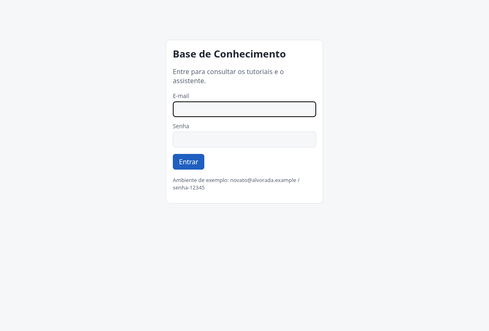
2. **Ler tutoriais**: só aparecem os documentos dos grupos do usuário (o de faixas salariais e o de deploy não aparecem para o `novato`).
   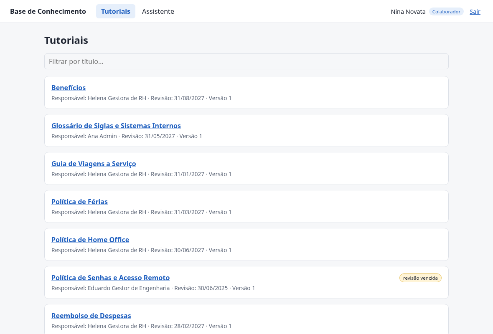 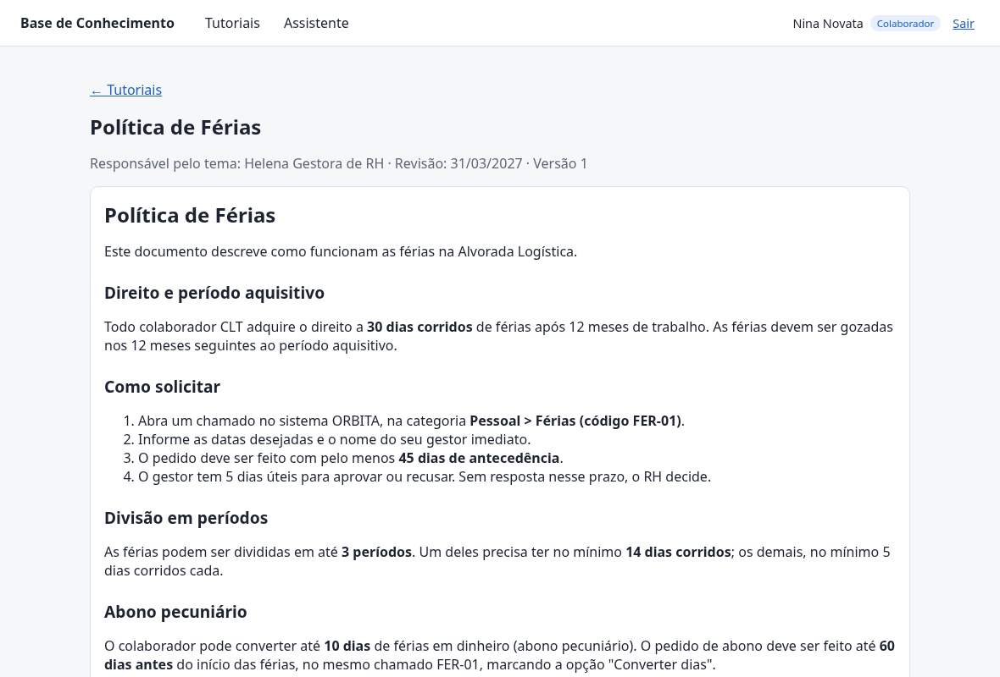
3. **Perguntar** ao assistente. Enquanto a resposta é gerada e validada, aparecem mensagens de progresso (“Coletando informações no banco de dados…”, “Gerando resposta…”, “Validando conteúdo…”, “Verificando a veracidade…”).
   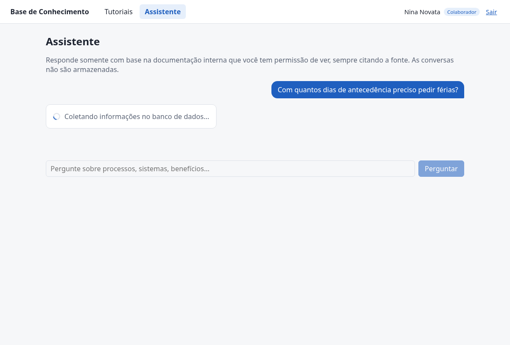
4. **Resposta citada**, com fontes (documento, seção, versão) e botões de feedback.
   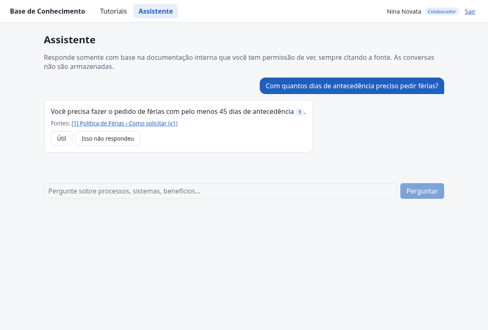
5. **Clicar na citação** abre, em nova aba, o trecho exato citado e o documento, com a seção destacada (se a versão citada não for mais a atual, a tela avisa).
   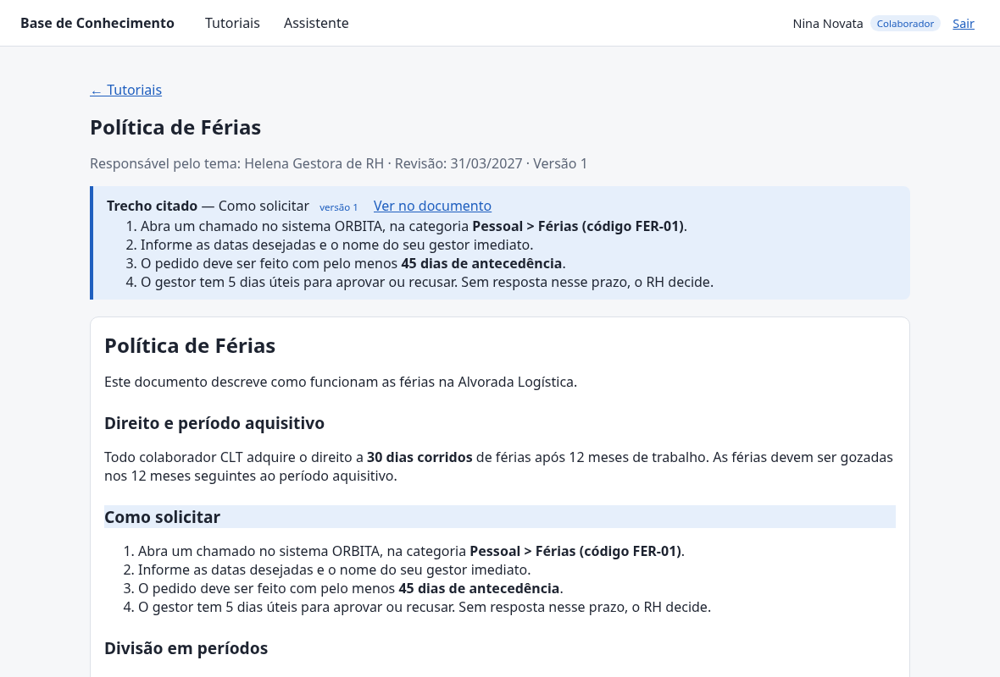
6. **Recusa**: sem evidência suficiente, o assistente não inventa; indica o responsável pelo tema e registra a lacuna de forma anônima. Perguntas sobre documentos sem permissão (ex.: faixas salariais) também são recusadas.
   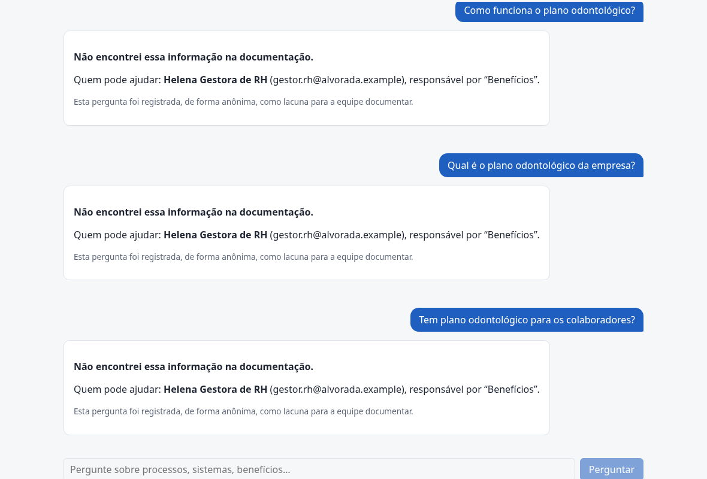 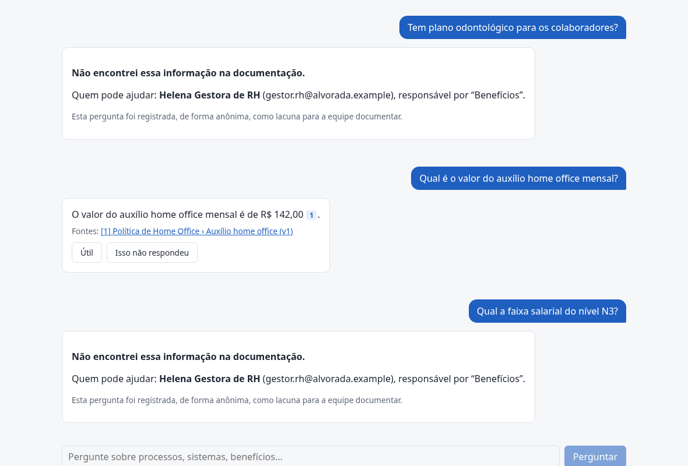
7. **“Isso não respondeu”**: registra feedback anônimo (e uma lacuna).
   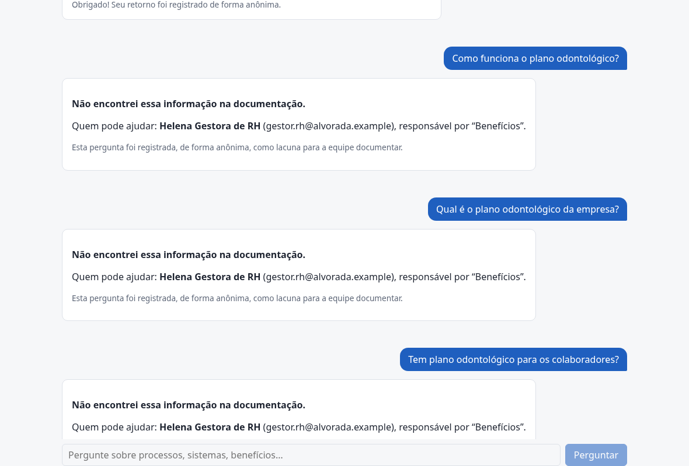
8. **Gestor** (`gestor.rh@alvorada.example`): o **Painel** mostra estatísticas agregadas, a lacuna agrupada (aparece só com ≥ K ocorrências; as perguntas isoladas ficam ocultas e apenas contadas) e os documentos com revisão vencida.
   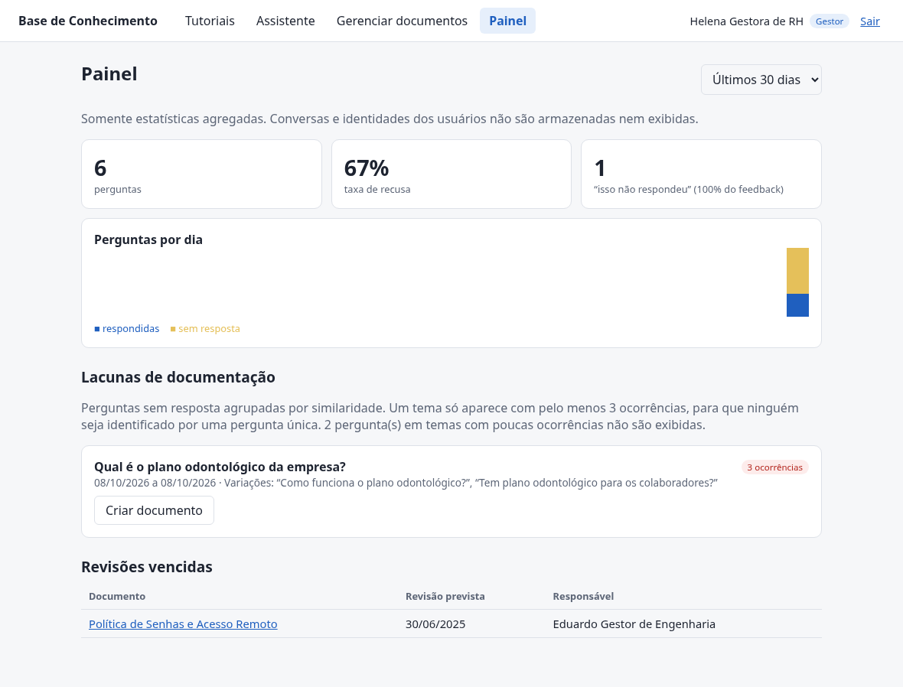
9. **Gerenciar documentos**: criar, editar, importar (PDF/DOCX/PPTX), definir responsável, data de revisão e grupos; histórico de versões.
   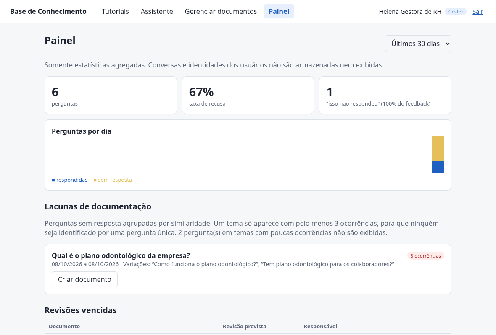 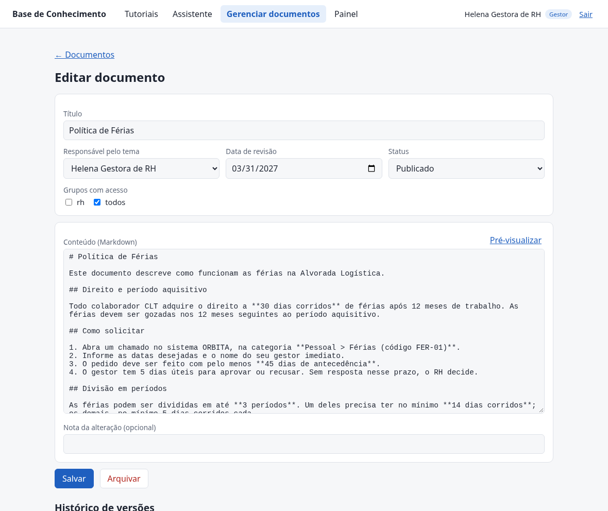
10. **Admin** (`admin@alvorada.example`): usuários, papéis e grupos.
    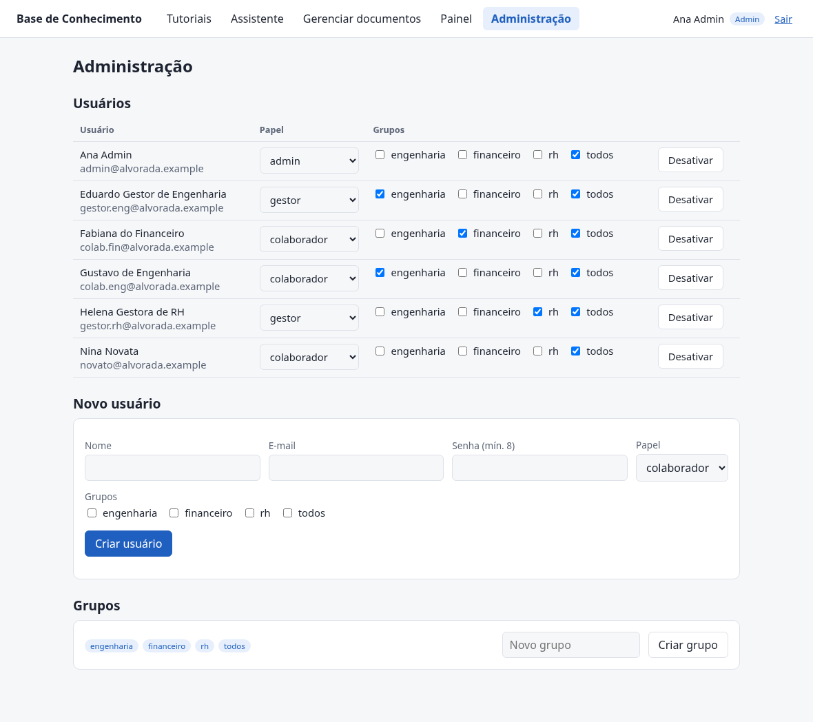

## Chat (API)

- `POST /api/chat` `{"question": "..."}` → Server-Sent Events: eventos `stage` (`retrieving`, `generating`, `validating`) e um `result` final com `status` (`answered`/`refused`), `answer`, `sources` (documento, seção, versão), `warnings` (revisão vencida) e `responsible` (na recusa). A resposta só é enviada depois de gerada e validada.
- `POST /api/chat/feedback` `{question, answer, helpful, comment?}` → 204. Sem vínculo com o usuário; avaliação negativa também registra uma lacuna.
- A busca do chat sempre respeita os grupos do usuário, inclusive para admin.

## Trocar modelos e provedor

Tudo no `.env` (ver `.env.example`): `LLM_PROVIDER` (`ollama` | `openai`), `LLM_MODEL`, `EMBEDDING_MODEL`, `REFUSAL_THRESHOLD`, `TOP_K`. Para outro modelo local: `ollama pull <modelo>` e ajuste `LLM_MODEL`. Com `LLM_PROVIDER=openai` (`OPENAI_BASE_URL`, `OPENAI_API_KEY`) perguntas e trechos **saem da máquina**; fica desligado por padrão. Trocar o modelo de embeddings exige ajustar `EMBEDDING_DIM` (e a coluna) e reindexar.

Resultado sobre o corpus de exemplo (13 perguntas, `qwen3.5:4b`, limiar 0,3), modo `rag`: Recall@3 = 1,0, MRR = 1,0, vazamentos = 0, recusa correta = 100% (sem resposta e vazamento), recusa indevida = 0%, citação da evidência esperada = 100%, aviso de revisão vencida = 100%, tempo total mediano ≈ 6 s. Conjunto pequeno: serve como teste de fumaça, não como estimativa de qualidade.

## Testes

```bash
cd backend && uv run pytest
```

Os testes usam o banco `kb_test` (recriado a cada execução).

## Permissões (resumo)

| Papel | Lê | Escreve |
|---|---|---|
| colaborador | documentos publicados dos seus grupos | – |
| gestor | documentos dos seus grupos (qualquer status), histórico de versões | documentos dos seus grupos |
| admin | tudo | tudo + usuários e grupos |
